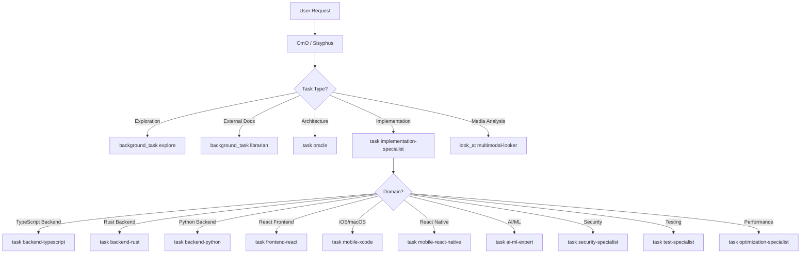

# Agent System

The OhMyOpenCode (OMO) Agent System is a sophisticated multi-model orchestration framework designed to handle complex software engineering tasks. It employs a multi-layered "Team Lead" model where a primary orchestrator manages specialized subagents through delegation hierarchies.

## Overview

The system is built on a hierarchical structure where **OmO** (the primary agent) acts as the central intelligence and project manager. OmO is built on the **Sisyphus** foundational orchestrator, extended with fork-specific capabilities. Complex implementation tasks are delegated through an **Implementation Specialist** (manager) to domain-specific specialists.

### Multi-Model Strategy

By leveraging different models (Claude Opus/Sonnet, GPT-5.2, Gemini Pro, Grok-Code), the system matches the specific strengths of each model to the task at hand, balancing reasoning depth, speed, and cost.

## Agent Hierarchy

```
OmO / Sisyphus (team-lead, Claude Opus)
├── implementation-specialist (manager, Claude Sonnet)
│   │
│   │   # Language/Platform Specialists
│   ├── backend-typescript (Claude Sonnet)
│   ├── backend-rust (Claude Sonnet)
│   ├── backend-python (Claude Sonnet)
│   ├── frontend-react (Gemini Pro)
│   ├── frontend-ui-ux-engineer (Gemini Pro)
│   ├── mobile-xcode (Gemini Pro)
│   ├── mobile-react-native (Gemini Pro)
│   ├── document-writer (Gemini Pro)
│   │
│   │   # AI/ML Specialists
│   ├── ai-ml-expert (Claude Opus)
│   ├── agent-specialist (Claude Opus)
│   │
│   │   # Cross-Cutting Specialists
│   ├── security-specialist (GPT-5.2)
│   ├── test-specialist (Claude Sonnet)
│   └── optimization-specialist (Claude Sonnet)
│
├── oracle (advisor, GPT-5.2) - read-only
├── librarian (utility, Claude Sonnet) - read-only
├── explore (utility, Grok) - read-only
└── multimodal-looker (utility, Gemini Flash) - read-only
```

## Role-Based Classification

| Role | Can Delegate | Modifies Files | Governance | Examples |
|------|--------------|----------------|------------|----------|
| **team-lead** | Yes (to anyone) | Yes | Full | OmO, Sisyphus |
| **manager** | Yes (to specialists) | Yes | Full | implementation-specialist |
| **specialist** | No (terminal) | Yes | Full | backend-typescript, frontend-react, etc. |
| **advisor** | No | No | None | oracle |
| **utility** | No | No | None | explore, librarian, multimodal-looker |

## Agent Registry

| Agent | Model | Role | Governance | Key Restrictions |
|-------|-------|------|------------|------------------|
| **OmO** | `claude-opus-4-5` | team-lead | Full | Primary orchestrator (Fork) |
| **Sisyphus** | `claude-opus-4-5` | team-lead | Full | Foundation orchestrator (Upstream) |
| **implementation-specialist** | `claude-sonnet-4-5` | manager | Full | Cannot call OmO |
| **backend-typescript** | `claude-sonnet-4-5` | specialist | Full | Cannot delegate |
| **backend-rust** | `claude-sonnet-4-5` | specialist | Full | Cannot delegate |
| **backend-python** | `claude-sonnet-4-5` | specialist | Full | Cannot delegate |
| **frontend-react** | `gemini-3-pro` | specialist | Full | Cannot delegate |
| **frontend-ui-ux-engineer** | `gemini-3-pro` | specialist | Full | Cannot delegate |
| **mobile-xcode** | `gemini-3-pro` | specialist | Full | Cannot delegate |
| **mobile-react-native** | `gemini-3-pro` | specialist | Full | Cannot delegate |
| **document-writer** | `gemini-3-pro` | specialist | Full | Cannot delegate |
| **ai-ml-expert** | `claude-opus-4-5` | specialist | Full | Cannot delegate |
| **agent-specialist** | `claude-opus-4-5` | specialist | Full | Cannot delegate |
| **security-specialist** | `gpt-5.2` | specialist | Full | Cannot delegate |
| **test-specialist** | `claude-sonnet-4-5` | specialist | Full | Cannot delegate |
| **optimization-specialist** | `claude-sonnet-4-5` | specialist | Full | Cannot delegate |
| **oracle** | `gpt-5.2` | advisor | None | No write/edit/task |
| **librarian** | `claude-sonnet-4-5` | utility | None | No write/edit |
| **explore** | `grok-code` | utility | None | READ-ONLY |
| **multimodal-looker** | `gemini-2.5-flash` | utility | None | READ-ONLY |

## Primary Orchestrators

The system features two primary orchestrators: **Sisyphus** (upstream foundation) and **OmO** (fork-specific extension). While OmO is the default, Sisyphus can be enabled as an experimental orchestrator for more structured workflows.

### Sisyphus Architecture

Sisyphus is the foundational orchestrator system, designed with a modular architecture that separates core orchestration logic from environment-specific extensions. It uses a builder pattern to construct dynamic system prompts.

#### Builder Pattern (sisyphus-prompt-builder.ts)
Prompt generation is handled by a dedicated builder that dynamically constructs the system prompt based on:
- **Available Agents**: Lists subagents and their specific triggers/costs.
- **Available Tools**: Categorizes tools (LSP, AST, Search) for appropriate selection.
- **Available Skills**: Injects custom project/user skills into the orchestration logic.

#### Operational Phases
Sisyphus operates through a structured lifecycle:
1. **Phase 0 - Intent Gate**: Classifies user requests (Trivial, Exploratory, Implementation, etc.) and checks for matching Skills or Key Triggers.
2. **Phase 1 - Codebase Assessment**: Evaluates codebase maturity (Disciplined, Transitional, Legacy) to adapt behavior.
3. **Phase 2A - Exploration**: Executes parallel search using Explore (internal) and Librarian (external) agents.
4. **Phase 2B - Implementation**: Manages task execution with obsessive Todo tracking and 7-Section delegation prompts.
5. **Phase 2C - Failure Recovery**: Implements a structured recovery flow for failed implementation attempts.
6. **Phase 3 - Completion**: Verifies all deliverables with evidence (lsp_diagnostics, build/test) before finishing.

#### Enabling Sisyphus
To enable Sisyphus as the primary orchestrator, update the configuration in `oh-my-opencode.json`:

```json
{
  "sisyphus_agent": {
    "enabled": true
  },
  "primary_orchestrator": "Sisyphus"
}
```

### OmO Migration & Fork Extensions

OmO has been migrated to a "Sisyphus-base + Fork Extensions" architecture. It is now a thin wrapper that composes the core Sisyphus foundation with specialized extensions for this fork. The final OmO prompt is created by concatenating the Sisyphus base prompt with the composed fork extensions. This ensures that OmO benefits from all upstream Sisyphus improvements while maintaining fork-specific governance and workflow requirements.

#### Fork Extensions (sisyphus-fork-extensions.ts)
These extensions add unique capabilities to the orchestrator through specialized builder functions:
- **buildGovernanceSection()**: Integrates Linear tools (`linear_branch`, `linear_update_status`) and enforces path validation rules for `src/`, `tests/`, and `docs/`.
- **buildSpecWorkflowSection()**: Implements spec-driven task management, synchronizing OpenCode todos with `tasks.md` artifacts in spec folders (`context/specs/` or `.cursor/specs/`).
- **buildLinearIntegrationSection()**: Handles Linear-specific workflows, including branch naming conventions and issue status transitions.
- **buildIntentGateExtensions()**: Adds decision logic for automatic spec folder creation based on task complexity (e.g., required for work estimated >4h).
- **buildDecisionMatrixExtensions()**: Expands the base decision matrix with fork-specific actions for Linear issues and Spec management.
- **buildPlaybooksSection()**: Provides specialized, step-by-step guides for Bugfixes, Refactors, and Debugging.


## Multi-Layered Orchestration

### Delegation Flow



### Delegation Depth Limits

To prevent context explosion and infinite loops:
- **Maximum depth**: 2 levels (OmO → Manager → Specialist)
- **Specialists cannot delegate**: `task: false` in tool config
- **Managers cannot call up**: Cannot invoke OmO or other managers

### Delegation Mechanisms

- **`task()`**: Synchronous delegation where the caller waits for a result
- **`background_task()`**: Asynchronous "fire-and-forget" operations
- **`look_at()`**: Specifically for multimodal-looker to analyze media files

## Governance System

### Governance Levels

| Level | Includes | Applied To |
|-------|----------|------------|
| **full** | Path validation, changelog, Linear, spec workflow | All file-modifying agents |
| **minimal** | Path validation, changelog only | (Reserved for future use) |
| **none** | No governance injection | Read-only agents, OmO (already has governance) |

### Governance Integration

Governance is integrated through both automatic hooks and explicit tools available to the orchestrator:

1. **Path Discipline**: Enforced by `governance-path-validator` and documented in the orchestrator prompt.
2. **Changelog Discipline**: Managed by `governance-historian`.
3. **Linear Integration**: Issue context auto-injected by `governance-linear-injector`; managed via `linear_*` tools.
4. **Spec-Driven Workflow**: Persistent planning tracked in `context/specs/` or `.cursor/specs/`.

### Governance Hooks

| Hook | Trigger | Purpose |
|------|---------|---------|
| `governance-path-validator` | Before file write | Validates paths follow conventions |
| `governance-historian` | After session | Creates changelog entries |
| `governance-linear-injector` | On issue ID detection | Injects Linear context |
| `governance-docs-delegation` | Before doc write | Enforces delegation to document-writer |

## Implementation Specialist

The Implementation Specialist acts as a delegation hub between OmO and specialized sub-agents.

### Responsibilities

1. **Task Decomposition**: Break complex tasks into domain-specific sub-tasks
2. **Specialist Selection**: Choose the right specialist for each sub-task
3. **Result Aggregation**: Combine specialist outputs into cohesive deliverables
4. **Quality Assurance**: Verify specialist work before returning to OmO

### Delegation Decision Tree

```
1. Is this AI/ML work? → ai-ml-expert
2. Is this agent/orchestration design? → agent-specialist
3. Is this security-focused? → security-specialist
4. Is this testing work? → test-specialist
5. Is this optimization work? → optimization-specialist
6. What language/platform?
   - Rust → backend-rust
   - Python → backend-python
   - TypeScript backend → backend-typescript
   - React/Next.js → frontend-react
   - Swift/iOS/macOS → mobile-xcode
   - React Native → mobile-react-native
   - Design-focused UI → frontend-ui-ux-engineer
   - Documentation → document-writer
```

## Specialized Subagents

### Advisor Agents (Read-Only)

#### Oracle (Strategic Advisor)
The "Senior Engineering Advisor" used for high-level design, architecture reviews, and complex debugging. It has high reasoning effort but is restricted from modifying files. Uses GPT-5.2 for deep analysis.

### Utility Agents (Read-Only)

#### Explore (Contextual Grep)
Optimized for internal codebase search. Sisyphus fires multiple Explore agents in parallel to map out unknown architectures quickly.

#### Librarian (External Researcher)
Specializes in external documentation, GitHub repository analysis, and open-source reference implementations. Provides evidence-based research for implementation details.

#### Multimodal Looker (Media Analyst)
Analyzes non-text files like PDFs, images, and diagrams to extract relevant information without bloating the orchestrator's context.

### Language/Platform Specialists

| Specialist | Model | Domain |
|------------|-------|--------|
| backend-typescript | Claude Sonnet | TypeScript/Node.js APIs, services, database |
| backend-rust | Claude Sonnet | Rust systems programming, Actix-web/Axum |
| backend-python | Claude Sonnet | Python/FastAPI/Django/Flask |
| frontend-react | Gemini Pro | React/Next.js components, hooks, state |
| frontend-ui-ux-engineer | Gemini Pro | Design-focused UI, aesthetics |
| mobile-xcode | Gemini Pro | iOS/macOS, Swift/SwiftUI |
| mobile-react-native | Gemini Pro | Cross-platform mobile |
| document-writer | Gemini Pro | Technical documentation |

### AI/ML Specialists

| Specialist | Model | Domain |
|------------|-------|--------|
| ai-ml-expert | Claude Opus | RAG, DSPy, Agno, LLM integration |
| agent-specialist | Claude Opus | Multi-agent design, OMO extensions |

### Cross-Cutting Specialists

| Specialist | Model | Domain |
|------------|-------|--------|
| security-specialist | GPT-5.2 | OWASP, vulnerability analysis |
| test-specialist | Claude Sonnet | Unit/integration/e2e testing |
| optimization-specialist | Claude Sonnet | Performance profiling |

### Workflow Specialists

| Specialist | Model | Domain |
|------------|-------|--------|
| product-strategist | Claude Sonnet | Feature specification, requirements |
| strategic-planner | Claude Sonnet | Implementation planning, architecture |
| task-planner | Claude Sonnet | Task breakdown, effort estimation |

These specialists power the workflow commands (`/specify`, `/plan`, `/tasks`) and are invoked automatically when users run those commands.

### Meta-Learning

| Specialist | Model | Domain |
|------------|-------|--------|
| context-learner | Claude Opus | Session analysis, pattern extraction |

The context-learner analyzes session transcripts to extract insights for improving orchestration, delegation patterns, and agent instructions.

## Agent Infrastructure

### Creation & Prompt Building

Agents are instantiated via `createBuiltinAgents()`. For orchestrators (OmO/Sisyphus), the prompt is built dynamically:
1. **Sisyphus Base**: Constructed via `buildDynamicSisyphusPrompt` using the available toolset and subagents.
2. **Governance Injection**: Fork-specific extensions are appended to incorporate Linear and Spec workflows.
3. **Environment Context**: Real-time info is injected into appropriate agents.

### Configuration Overrides

Agents and orchestrators can be customized in `oh-my-opencode.json`:

```json
{
  "omo_agent": {
    "disabled": false
  },
  "sisyphus_agent": {
    "enabled": true
  },
  "primary_orchestrator": "Sisyphus",
  "agents": {
    "overrides": {
      "oracle": {
        "model": "openai/o1",
        "temperature": 1.0
      }
    }
  }
}
```

## Tool Restrictions by Role

| Role | write | edit | task | background_task | bash |
|------|:-----:|:----:|:----:|:---------------:|:----:|
| team-lead | ✅ | ✅ | ✅ | ✅ | ✅ |
| manager | ✅ | ✅ | ✅ | ✅ | ✅ |
| specialist | ✅ | ✅ | ❌ | ❌ | ✅ |
| advisor | ❌ | ❌ | ❌ | ❌ | ✅ |
| utility | ❌ | ❌ | ❌ | ❌ | ✅ |

## Structured Response Format

All specialists return results in a consistent JSON format:

```json
{
  "status": "success|partial|failed",
  "summary": "Brief description of work completed",
  "files": {
    "created": ["path/to/new/file.ts"],
    "modified": ["path/to/changed/file.ts"]
  },
  "errors": ["Optional: any errors encountered"],
  "nextSteps": ["Optional: recommended follow-up actions"]
}
```

This enables predictable handoffs between agents and result aggregation by the Implementation Specialist.
